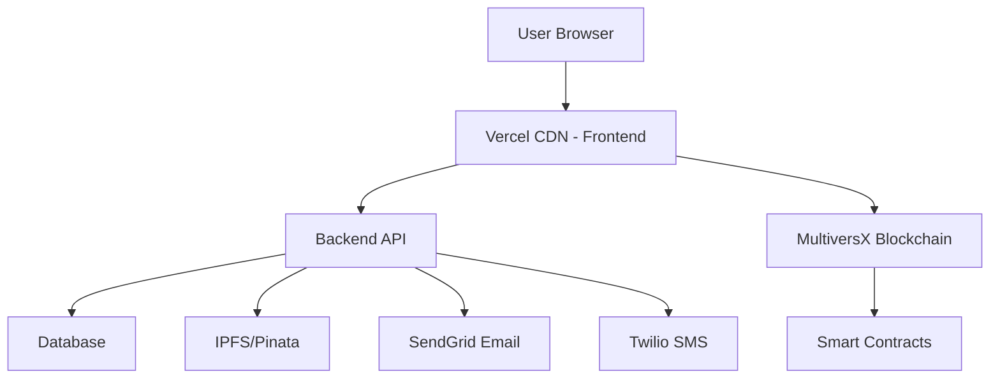

# 🚀 Guide de Déploiement DEMOCRATIX sur Vercel

**Date**: 5 Novembre 2025
**Version**: v1.3.7
**Auteur**: Documentation Technique DEMOCRATIX

---

## 📋 Table des Matières

1. [Vue d'Ensemble](#vue-densemble)
2. [Prérequis](#prérequis)
3. [Préparation du Projet](#préparation-du-projet)
4. [Déploiement Frontend sur Vercel](#déploiement-frontend-sur-vercel)
5. [Déploiement Backend](#déploiement-backend)
6. [Configuration des Variables d'Environnement](#configuration-des-variables-denvironnement)
7. [Déploiement des Smart Contracts](#déploiement-des-smart-contracts)
8. [Configuration DNS et Domaines](#configuration-dns-et-domaines)
9. [Optimisations et Performance](#optimisations-et-performance)
10. [Monitoring et Logs](#monitoring-et-logs)
11. [CI/CD avec GitHub Actions](#cicd-avec-github-actions)
12. [Dépannage](#dépannage)

---

## 🎯 Vue d'Ensemble

DEMOCRATIX est composé de 3 parties à déployer :

```
┌─────────────────────────────────────────────────────────┐
│                    DEMOCRATIX Stack                      │
├─────────────────────────────────────────────────────────┤
│                                                           │
│  1. Frontend (React + Vite)                              │
│     └─> Vercel Frontend Hosting                          │
│                                                           │
│  2. Backend (Node.js + Express + WebSocket)              │
│     └─> Options:                                         │
│         - Vercel Serverless Functions                    │
│         - Railway / Render / AWS (recommandé pour WS)    │
│                                                           │
│  3. Smart Contracts (Rust)                               │
│     └─> MultiversX Blockchain (Testnet/Mainnet)         │
│                                                           │
└─────────────────────────────────────────────────────────┘
```

### Architecture de Production



---

## ✅ Prérequis

### 1. Comptes Nécessaires

- ✅ **GitHub Account** (pour héberger le code)
- ✅ **Vercel Account** (gratuit) - [vercel.com](https://vercel.com)
- ✅ **Pinata Account** (IPFS) - Déjà configuré ✅
- ✅ **SendGrid Account** (Email) - Déjà configuré ✅
- ⚠️ **Twilio Account** (SMS) - Optionnel, nécessite documents business
- ✅ **MultiversX Wallet** avec fonds suffisants pour déployer les contracts

### 2. Outils Installés Localement

```bash
# Node.js 18+ et npm
node --version  # doit être >= 18
npm --version

# Git
git --version

# Vercel CLI (optionnel mais recommandé)
npm install -g vercel

# MultiversX tools (pour déployer les contracts)
# WSL2 + sc-meta déjà installés ✅
```

### 3. Fichiers à Vérifier

```bash
# Frontend
frontend/.env                    # Variables d'environnement
frontend/vercel.json             # Configuration Vercel (à créer)
frontend/package.json            # Scripts de build

# Backend
backend/.env                     # Variables d'environnement
backend/vercel.json              # Configuration Vercel (à créer)
backend/package.json             # Scripts de build

# Contracts
contracts/voting/wasm/*.wasm     # Binaries compilés
contracts/voting/wasm/*.abi.json # ABIs
```

---

## 🛠️ Préparation du Projet

### Étape 1 : Nettoyer le Projet

```bash
# Supprimer les fichiers inutiles
cd C:\Users\DEEPGAMING\MultiversX\DEMOCRATIX

# Nettoyer les node_modules (seront réinstallés par Vercel)
# NE PAS COMMIT node_modules, .env, ou les secrets

# Vérifier le .gitignore
cat .gitignore
```

**Vérifier que `.gitignore` contient :**

```gitignore
# Dependencies
node_modules/
*/node_modules/

# Environment variables
.env
.env.local
.env.production
*.env

# Build outputs
dist/
build/
.next/
out/

# Logs
*.log
npm-debug.log*

# IDE
.vscode/
.idea/

# OS
.DS_Store
Thumbs.db

# Secrets
backend/.secure-keys/
backend/circuits/
*.ptau
*.zkey
verification_key.json

# Temporary files
*.tmp
*.temp
```

### Étape 2 : Créer les Fichiers de Configuration Vercel

#### Frontend - `frontend/vercel.json`

```json
{
  "version": 2,
  "buildCommand": "npm run build",
  "outputDirectory": "dist",
  "installCommand": "npm install",
  "framework": "vite",
  "rewrites": [
    {
      "source": "/(.*)",
      "destination": "/index.html"
    }
  ],
  "headers": [
    {
      "source": "/(.*)",
      "headers": [
        {
          "key": "X-Content-Type-Options",
          "value": "nosniff"
        },
        {
          "key": "X-Frame-Options",
          "value": "DENY"
        },
        {
          "key": "X-XSS-Protection",
          "value": "1; mode=block"
        },
        {
          "key": "Referrer-Policy",
          "value": "strict-origin-when-cross-origin"
        },
        {
          "key": "Permissions-Policy",
          "value": "camera=(), microphone=(), geolocation=()"
        }
      ]
    }
  ],
  "env": {
    "VITE_NETWORK": "@vite_network",
    "VITE_VOTING_CONTRACT": "@vite_voting_contract",
    "VITE_VOTER_REGISTRY_CONTRACT": "@vite_voter_registry_contract",
    "VITE_RESULTS_CONTRACT": "@vite_results_contract",
    "VITE_API_URL": "@vite_api_url",
    "VITE_BACKEND_API_URL": "@vite_backend_api_url",
    "VITE_PINATA_API_KEY": "@vite_pinata_api_key",
    "VITE_PINATA_SECRET_API_KEY": "@vite_pinata_secret_api_key",
    "VITE_PINATA_JWT": "@vite_pinata_jwt"
  }
}
```

#### Backend - `backend/vercel.json`

⚠️ **IMPORTANT** : Vercel Serverless Functions ont des limitations pour WebSocket.
Si vous utilisez WebSocket, préférez Railway/Render (voir section suivante).

```json
{
  "version": 2,
  "builds": [
    {
      "src": "src/index.ts",
      "use": "@vercel/node"
    }
  ],
  "routes": [
    {
      "src": "/api/(.*)",
      "dest": "src/index.ts"
    }
  ],
  "env": {
    "NODE_ENV": "production",
    "API_PORT": "3000",
    "MULTIVERSX_NETWORK": "@multiversx_network",
    "MULTIVERSX_API_URL": "@multiversx_api_url",
    "VOTING_CONTRACT": "@voting_contract",
    "VOTER_REGISTRY_CONTRACT": "@voter_registry_contract",
    "RESULTS_CONTRACT": "@results_contract",
    "SENDGRID_API_KEY": "@sendgrid_api_key",
    "SENDGRID_FROM_EMAIL": "@sendgrid_from_email",
    "TWILIO_ACCOUNT_SID": "@twilio_account_sid",
    "TWILIO_AUTH_TOKEN": "@twilio_auth_token",
    "TWILIO_PHONE_NUMBER": "@twilio_phone_number"
  }
}
```

### Étape 3 : Optimiser les Scripts de Build

#### `frontend/package.json` - Vérifier les scripts

```json
{
  "scripts": {
    "dev": "vite",
    "build": "tsc && vite build",
    "preview": "vite preview",
    "type-check": "tsc --noEmit"
  }
}
```

#### `backend/package.json` - Vérifier les scripts

```json
{
  "scripts": {
    "start": "node dist/index.js",
    "build": "tsc",
    "dev": "nodemon --exec ts-node src/index.ts",
    "vercel-build": "npm run build"
  }
}
```

### Étape 4 : Committer et Pousser sur GitHub

```bash
# Initialiser Git si ce n'est pas déjà fait
cd C:\Users\DEEPGAMING\MultiversX\DEMOCRATIX
git init

# Ajouter le remote GitHub
git remote add origin https://github.com/x-univert/DEMOCRATIX.git

# Créer une branche de production
git checkout -b production

# Ajouter tous les fichiers
git add .

# Commit
git commit -m "feat: Prepare for Vercel deployment with v1.3.7"

# Pousser vers GitHub
git push origin production
```

---

## 🎨 Déploiement Frontend sur Vercel

### Méthode 1 : Via l'Interface Web Vercel (Recommandé pour la première fois)

#### Étape 1 : Se Connecter à Vercel

1. Aller sur [vercel.com](https://vercel.com)
2. **Sign Up** ou **Log In** avec votre compte GitHub
3. Autoriser Vercel à accéder à vos repos GitHub

#### Étape 2 : Importer le Projet

1. Cliquer sur **"Add New Project"**
2. **Import Git Repository**
3. Chercher et sélectionner `DEMOCRATIX`
4. Cliquer sur **"Import"**

#### Étape 3 : Configurer le Projet Frontend

```yaml
Project Name: democratix-frontend
Framework Preset: Vite
Root Directory: frontend
Build Command: npm run build
Output Directory: dist
Install Command: npm install
Node.js Version: 18.x
```

#### Étape 4 : Configurer les Variables d'Environnement

Dans Vercel Dashboard → **Settings** → **Environment Variables**

**⚠️ IMPORTANT : Choisir l'environnement pour chaque variable (Production / Preview / Development)**

##### Production (Mainnet)

```env
VITE_NETWORK=mainnet
VITE_VOTING_CONTRACT=<adresse_contract_mainnet>
VITE_VOTER_REGISTRY_CONTRACT=<adresse_registry_mainnet>
VITE_RESULTS_CONTRACT=<adresse_results_mainnet>

# API MultiversX Mainnet
VITE_API_URL=https://api.multiversx.com
VITE_GATEWAY_URL=https://gateway.multiversx.com
VITE_EXPLORER_URL=https://explorer.multiversx.com

# Backend API (votre backend déployé)
VITE_BACKEND_API_URL=https://democratix-api.vercel.app

# IPFS Pinata (mêmes clés pour tous les environnements)
VITE_PINATA_API_KEY=582556ecae27aec7767f
VITE_PINATA_SECRET_API_KEY=a269c8791384c64e19ba45451bec2b76d17c5ce39af798a550e82aefdd7e4cb6
VITE_PINATA_JWT=<votre_jwt_pinata>
```

##### Preview (Testnet) - Pour les branches de test

```env
VITE_NETWORK=testnet
VITE_VOTING_CONTRACT=<adresse_contract_testnet>
VITE_VOTER_REGISTRY_CONTRACT=<adresse_registry_testnet>
VITE_RESULTS_CONTRACT=<adresse_results_testnet>

VITE_API_URL=https://testnet-api.multiversx.com
VITE_GATEWAY_URL=https://testnet-gateway.multiversx.com
VITE_EXPLORER_URL=https://testnet-explorer.multiversx.com

VITE_BACKEND_API_URL=https://democratix-api-staging.vercel.app

# IPFS (mêmes)
VITE_PINATA_API_KEY=582556ecae27aec7767f
VITE_PINATA_SECRET_API_KEY=a269c8791384c64e19ba45451bec2b76d17c5ce39af798a550e82aefdd7e4cb6
VITE_PINATA_JWT=<votre_jwt_pinata>
```

##### Development (Devnet) - Pour les branches de dev

```env
VITE_NETWORK=devnet
VITE_VOTING_CONTRACT=erd1qqqqqqqqqqqqqpgq3rdh76wraer3vd36awamzfe0f8cxs0s8d3qqf5h6tl
VITE_VOTER_REGISTRY_CONTRACT=erd1qqqqqqqqqqqqqpgqu6z244pwew5ep7r0mv59aa2snm80pgv6d3qqce2mtu
VITE_RESULTS_CONTRACT=erd1qqqqqqqqqqqqqpgqk3pxj5l8px3cvv8a26jh0fwtw4mqh7u0d3qq8p9pnr

VITE_API_URL=https://devnet-api.multiversx.com
VITE_GATEWAY_URL=https://devnet-gateway.multiversx.com
VITE_EXPLORER_URL=https://devnet-explorer.multiversx.com

VITE_BACKEND_API_URL=http://localhost:3003

# IPFS (mêmes)
VITE_PINATA_API_KEY=582556ecae27aec7767f
VITE_PINATA_SECRET_API_KEY=a269c8791384c64e19ba45451bec2b76d17c5ce39af798a550e82aefdd7e4cb6
VITE_PINATA_JWT=<votre_jwt_pinata>
```

#### Étape 5 : Déployer

1. Cliquer sur **"Deploy"**
2. Attendre la fin du build (environ 2-5 minutes)
3. Une fois terminé, vous obtenez une URL : `https://democratix-frontend.vercel.app`

#### Étape 6 : Vérifier le Déploiement

1. Ouvrir l'URL fournie
2. Vérifier que :
   - ✅ Le site s'affiche correctement
   - ✅ La connexion wallet fonctionne
   - ✅ Les élections se chargent
   - ✅ Les images IPFS s'affichent
   - ✅ Le thème fonctionne
   - ✅ L'i18n (FR/EN/ES) fonctionne

### Méthode 2 : Via Vercel CLI

```bash
# Installer Vercel CLI
npm install -g vercel

# Se connecter
vercel login

# Déployer le frontend
cd frontend
vercel --prod

# Suivre les prompts
# - Link to existing project? No
# - Project name: democratix-frontend
# - Directory: ./
# - Override settings? No
```

---

## 🔧 Déploiement Backend

### Option A : Vercel Serverless Functions

⚠️ **LIMITATIONS** :
- ❌ WebSocket ne fonctionne pas (pas de connexions persistantes)
- ❌ Timeout de 10 secondes pour les fonctions (hobby plan)
- ❌ Cold start possible (première requête lente)

**Si vous n'utilisez PAS WebSocket**, Vercel convient :

```bash
cd backend
vercel --prod
```

### Option B : Railway (Recommandé pour WebSocket)

Railway supporte WebSocket et les connexions persistantes.

#### Étape 1 : Créer un Compte Railway

1. Aller sur [railway.app](https://railway.app)
2. Sign Up avec GitHub
3. **New Project** → **Deploy from GitHub repo**

#### Étape 2 : Configurer le Projet

```yaml
Project Name: democratix-backend
Root Directory: backend
Start Command: npm start
Build Command: npm run build
```

#### Étape 3 : Variables d'Environnement Railway

Dans Railway Dashboard → **Variables**

```env
NODE_ENV=production
API_PORT=3000

# MultiversX Configuration
MULTIVERSX_NETWORK=mainnet
MULTIVERSX_API_URL=https://api.multiversx.com
MULTIVERSX_GATEWAY_URL=https://gateway.multiversx.com

# Smart Contracts (Mainnet - à remplir après déploiement)
VOTING_CONTRACT=erd1qqqqqqqqqqqqqpgq...
VOTER_REGISTRY_CONTRACT=erd1qqqqqqqqqqqqqpgq...
RESULTS_CONTRACT=erd1qqqqqqqqqqqqqpgq...

# SendGrid Email
SENDGRID_API_KEY=SG.xxxxxxxxxxxxxxxxxxxxx
SENDGRID_FROM_EMAIL=noreply@democratix.app
SENDGRID_FROM_NAME=DEMOCRATIX

# Twilio SMS (optionnel)
TWILIO_ACCOUNT_SID=ACxxxxxxxxxxxxx
TWILIO_AUTH_TOKEN=xxxxxxxxxxxxx
TWILIO_PHONE_NUMBER=+1234567890

# ElGamal Keys (générer de nouvelles clés pour production !)
ELGAMAL_PUBLIC_KEY=<générer_en_production>
ELGAMAL_PRIVATE_KEY=<générer_en_production>

# CORS
CORS_ORIGIN=https://democratix-frontend.vercel.app

# Logging
LOG_LEVEL=info
```

#### Étape 4 : Déployer

1. Cliquer sur **"Deploy"**
2. Railway génère une URL : `https://democratix-backend.railway.app`
3. Tester : `https://democratix-backend.railway.app/api/health`

### Option C : Render.com

Alternative similaire à Railway.

1. Aller sur [render.com](https://render.com)
2. **New** → **Web Service**
3. Connecter le repo GitHub
4. Configurer :
   ```yaml
   Name: democratix-backend
   Environment: Node
   Build Command: npm install && npm run build
   Start Command: npm start
   ```
5. Ajouter les variables d'environnement (mêmes que Railway)

### Option D : AWS Elastic Beanstalk / EC2

Pour plus de contrôle et performance, mais plus complexe.

---

## 🔐 Configuration des Variables d'Environnement

### Sécurité des Secrets

**❌ NE JAMAIS** :
- Committer les fichiers `.env`
- Partager les clés API publiquement
- Utiliser les mêmes clés en dev et prod

**✅ TOUJOURS** :
- Utiliser des secrets différents par environnement
- Générer de nouvelles clés ElGamal pour production
- Activer 2FA sur tous les comptes (Vercel, SendGrid, Twilio, etc.)
- Utiliser des API keys avec permissions minimales

### Rotation des Secrets

**Planifier la rotation des clés tous les 3 mois** :
- Clés ElGamal
- Clés SendGrid
- Clés Twilio
- Clés Pinata

### Checklist Variables d'Environnement

```bash
# Frontend
✅ VITE_NETWORK
✅ VITE_VOTING_CONTRACT
✅ VITE_VOTER_REGISTRY_CONTRACT
✅ VITE_RESULTS_CONTRACT
✅ VITE_API_URL
✅ VITE_BACKEND_API_URL
✅ VITE_PINATA_API_KEY
✅ VITE_PINATA_SECRET_API_KEY
✅ VITE_PINATA_JWT

# Backend
✅ NODE_ENV
✅ API_PORT
✅ MULTIVERSX_NETWORK
✅ MULTIVERSX_API_URL
✅ VOTING_CONTRACT
✅ VOTER_REGISTRY_CONTRACT
✅ RESULTS_CONTRACT
✅ SENDGRID_API_KEY
✅ SENDGRID_FROM_EMAIL
⚠️ TWILIO_ACCOUNT_SID (optionnel)
⚠️ TWILIO_AUTH_TOKEN (optionnel)
⚠️ TWILIO_PHONE_NUMBER (optionnel)
✅ ELGAMAL_PUBLIC_KEY
✅ ELGAMAL_PRIVATE_KEY
✅ CORS_ORIGIN
```

---

## ⛓️ Déploiement des Smart Contracts

### Préparation

#### 1. Compiler les Contracts

```bash
# WSL2
cd /mnt/c/Users/DEEPGAMING/MultiversX/DEMOCRATIX/contracts/voting

# Nettoyer les anciens builds
cargo clean

# Compiler avec optimisations pour production
sc-meta all build --target-dir output --locked

# Vérifier les fichiers générés
ls -la output/voting.wasm
ls -la output/voting.abi.json
```

#### 2. Audit des Contracts (Recommandé pour Mainnet)

Avant de déployer sur Mainnet, **faire auditer les contracts** :
- [Arda - MultiversX Audit](https://arda.run)
- [Hacken](https://hacken.io)
- [CertiK](https://www.certik.com)

### Déploiement sur Testnet

#### Étape 1 : Préparer le Wallet

```bash
# Créer un nouveau wallet pour Testnet
# Aller sur https://testnet-wallet.multiversx.com
# Ou utiliser mxpy

# Obtenir des fonds de test
# Testnet Faucet: https://r3d4.fr/faucet
```

#### Étape 2 : Déployer avec mxpy

```bash
# Installer mxpy si ce n'est pas déjà fait
pip3 install multiversx-sdk-cli --upgrade

# Déployer le voting contract
mxpy contract deploy \
  --bytecode=output/voting.wasm \
  --pem=testnet-wallet.pem \
  --proxy=https://testnet-gateway.multiversx.com \
  --chain=T \
  --gas-limit=100000000 \
  --send \
  --recall-nonce

# Sauvegarder l'adresse retournée
# Exemple: erd1qqqqqqqqqqqqqpgq...

# Déployer le voter_registry contract
mxpy contract deploy \
  --bytecode=output/voter_registry.wasm \
  --pem=testnet-wallet.pem \
  --proxy=https://testnet-gateway.multiversx.com \
  --chain=T \
  --gas-limit=100000000 \
  --send \
  --recall-nonce

# Déployer le results contract
mxpy contract deploy \
  --bytecode=output/results.wasm \
  --pem=testnet-wallet.pem \
  --proxy=https://testnet-gateway.multiversx.com \
  --chain=T \
  --gas-limit=100000000 \
  --send \
  --recall-nonce
```

#### Étape 3 : Vérifier le Déploiement

```bash
# Vérifier sur l'Explorer
# https://testnet-explorer.multiversx.com/accounts/<contract_address>

# Tester une requête
mxpy contract query \
  erd1qqqqqqqqqqqqqpgq... \
  --proxy=https://testnet-gateway.multiversx.com \
  --function=getElections
```

#### Étape 4 : Mettre à Jour les Configs

```typescript
// frontend/src/config/config.testnet.ts
export const votingContract = 'erd1qqqqqqqqqqqqqpgq...'; // Nouvelle adresse
export const voterRegistryContract = 'erd1qqqqqqqqqqqqqpgq...';
export const resultsContract = 'erd1qqqqqqqqqqqqqpgq...';
```

### Déploiement sur Mainnet

⚠️ **ATTENTION** : Mainnet = Argent réel !

#### Checklist Avant Mainnet

- [ ] Contrats audités par un tiers de confiance
- [ ] Tests complets sur Testnet (minimum 2 semaines)
- [ ] Tests de charge (combien d'élections simultanées ?)
- [ ] Tests de sécurité (tentatives d'exploit)
- [ ] Backup du code et des clés
- [ ] Plan de rollback en cas de problème
- [ ] Assurance que le contrat est upgradeable
- [ ] Documentation utilisateur complète

#### Étape 1 : Préparer le Wallet Mainnet

```bash
# IMPORTANT : Sécuriser le wallet
# - Utiliser un hardware wallet (Ledger)
# - Ou un PEM file ultra sécurisé (coffre-fort, chiffré)
# - Activer 2FA partout

# Acheter des EGLD
# Minimum requis : ~10 EGLD pour déployer 3 contracts + gas futures transactions
```

#### Étape 2 : Déployer sur Mainnet

```bash
# DOUBLE VÉRIFIER que vous utilisez le bon fichier .wasm
# DOUBLE VÉRIFIER que vous utilisez le bon wallet
# DOUBLE VÉRIFIER que vous êtes sur Mainnet (chain=1)

mxpy contract deploy \
  --bytecode=output/voting.wasm \
  --pem=mainnet-wallet.pem \
  --proxy=https://gateway.multiversx.com \
  --chain=1 \
  --gas-limit=100000000 \
  --send \
  --recall-nonce

# Répéter pour voter_registry et results
```

#### Étape 3 : Vérifier et Publier

```bash
# Vérifier sur l'Explorer Mainnet
# https://explorer.multiversx.com/accounts/<contract_address>

# Publier le code source (optionnel mais recommandé pour la transparence)
# MultiversX permet de vérifier les contracts sur l'Explorer
```

#### Étape 4 : Mettre à Jour les Configs Production

```typescript
// frontend/src/config/config.mainnet.ts
export const votingContract = 'erd1qqqqqqqqqqqqqpgq...'; // Adresse Mainnet
export const voterRegistryContract = 'erd1qqqqqqqqqqqqqpgq...';
export const resultsContract = 'erd1qqqqqqqqqqqqqpgq...';
```

```env
# backend/.env.production
VOTING_CONTRACT=erd1qqqqqqqqqqqqqpgq...
VOTER_REGISTRY_CONTRACT=erd1qqqqqqqqqqqqqpgq...
RESULTS_CONTRACT=erd1qqqqqqqqqqqqqpgq...
```

#### Étape 5 : Redéployer Frontend et Backend

```bash
# Frontend Vercel - redéployer avec les nouvelles adresses
vercel --prod

# Backend Railway/Render - mettre à jour les variables d'env et redéployer
```

---

## 🌐 Configuration DNS et Domaines

### Acheter un Domaine

Recommandations :
- **Namecheap** (pas cher, bon support)
- **Google Domains** (simple)
- **Cloudflare Registrar** (le moins cher + CDN gratuit)

Exemples :
- `democratix.app`
- `democratix.io`
- `democratix.vote`

### Configurer le DNS dans Vercel

#### Frontend

1. Dans Vercel Dashboard → **Settings** → **Domains**
2. **Add Domain** : `democratix.app`
3. Vercel vous donne des enregistrements DNS à configurer

**Chez votre registrar (Namecheap, etc.) :**

```dns
Type    Name    Value
----    ----    -----
A       @       76.76.21.21 (IP Vercel)
CNAME   www     cname.vercel-dns.com
```

4. Attendre la propagation DNS (5-60 minutes)
5. Vérifier : `https://democratix.app`

#### Backend

Si vous utilisez Railway/Render, vous pouvez également configurer un sous-domaine :

```dns
Type    Name    Value
----    ----    -----
CNAME   api     democratix-backend.railway.app
```

Résultat : `https://api.democratix.app`

### Activer HTTPS/SSL

- **Vercel** : SSL automatique avec Let's Encrypt (gratuit)
- **Railway/Render** : SSL automatique aussi

✅ Aucune configuration nécessaire !

### Configurer Cloudflare (Optionnel mais Recommandé)

Cloudflare offre :
- 🚀 CDN global gratuit
- 🛡️ Protection DDoS
- 🔒 SSL flexible
- 📊 Analytics
- ⚡ Optimisations automatiques

#### Étape 1 : Ajouter le Site à Cloudflare

1. Aller sur [cloudflare.com](https://cloudflare.com)
2. **Add a Site** : `democratix.app`
3. Choisir le plan **Free**

#### Étape 2 : Changer les Nameservers

Cloudflare vous donne 2 nameservers :
```
ns1.cloudflare.com
ns2.cloudflare.com
```

Aller chez votre registrar (Namecheap) et changer les nameservers.

#### Étape 3 : Configurer les DNS dans Cloudflare

```dns
Type    Name    Value               Proxy
----    ----    -----               -----
A       @       76.76.21.21         ✅ Proxied
CNAME   www     democratix.app      ✅ Proxied
CNAME   api     <railway_url>       ✅ Proxied
```

#### Étape 4 : Activer les Optimisations

Dans Cloudflare Dashboard :

**Speed** :
- ✅ Auto Minify (HTML, CSS, JS)
- ✅ Brotli
- ✅ Early Hints
- ✅ HTTP/3 (QUIC)

**Security** :
- ✅ SSL/TLS : Full (strict)
- ✅ Always Use HTTPS
- ✅ Automatic HTTPS Rewrites
- ✅ Security Level : Medium
- ✅ Challenge Passage : 30 minutes

**Caching** :
- ✅ Caching Level : Standard
- ✅ Browser Cache TTL : 4 hours

---

## ⚡ Optimisations et Performance

### Frontend Optimizations

#### 1. Code Splitting

Déjà implémenté avec React.lazy :

```typescript
// frontend/src/routes/routes.ts
const AdminDashboard = lazy(() => import('../pages/AdminDashboard'));
const CreateElection = lazy(() => import('../pages/CreateElection'));
// etc.
```

#### 2. Image Optimization

```typescript
// Utiliser des formats modernes
// IPFS devrait servir WebP quand possible

// Lazy load images

```

#### 3. Bundle Analysis

```bash
cd frontend
npm install --save-dev rollup-plugin-visualizer

# Analyser le bundle
npm run build
# Ouvrir stats.html généré
```

#### 4. Supprimer les Console.logs en Production

```typescript
// vite.config.ts
export default defineConfig({
  esbuild: {
    drop: process.env.NODE_ENV === 'production' ? ['console', 'debugger'] : [],
  },
});
```

### Backend Optimizations

#### 1. Activer la Compression

```typescript
// backend/src/index.ts
import compression from 'compression';

app.use(compression());
```

#### 2. Caching avec Redis (Optionnel)

Pour les requêtes fréquentes (ex: liste des élections) :

```bash
# Ajouter Redis sur Railway
npm install redis
```

```typescript
// backend/src/services/cacheService.ts
import { createClient } from 'redis';

const redis = createClient({
  url: process.env.REDIS_URL
});

export async function getCachedElections() {
  const cached = await redis.get('elections:all');
  if (cached) return JSON.parse(cached);

  // Sinon, récupérer depuis l'API
  const elections = await fetchElections();

  // Mettre en cache pour 1 minute
  await redis.setEx('elections:all', 60, JSON.stringify(elections));

  return elections;
}
```

#### 3. Rate Limiting

```typescript
// backend/src/middleware/rateLimiter.ts
import rateLimit from 'express-rate-limit';

export const apiLimiter = rateLimit({
  windowMs: 15 * 60 * 1000, // 15 minutes
  max: 100, // Max 100 requêtes par IP
  message: 'Too many requests from this IP',
});

// Appliquer
app.use('/api/', apiLimiter);
```

### Database (Futur)

Si vous ajoutez une base de données (PostgreSQL) :

**Railway** offre PostgreSQL gratuit :
1. Railway Dashboard → **New** → **Database** → **PostgreSQL**
2. Utiliser Prisma ORM pour TypeScript

---

## 📊 Monitoring et Logs

### Vercel Analytics

**Gratuit** sur tous les plans Vercel :

1. Vercel Dashboard → **Analytics**
2. Voir :
   - Page views
   - Unique visitors
   - Top pages
   - Real User Metrics (Core Web Vitals)

### Sentry (Error Tracking)

**Gratuit jusqu'à 5K errors/mois** :

#### Installation

```bash
# Frontend
cd frontend
npm install @sentry/react @sentry/tracing

# Backend
cd backend
npm install @sentry/node @sentry/tracing
```

#### Configuration Frontend

```typescript
// frontend/src/main.tsx
import * as Sentry from '@sentry/react';

if (import.meta.env.PROD) {
  Sentry.init({
    dsn: 'https://xxx@xxx.ingest.sentry.io/xxx',
    environment: import.meta.env.VITE_NETWORK,
    tracesSampleRate: 0.1,
    integrations: [
      new Sentry.BrowserTracing(),
    ],
  });
}
```

#### Configuration Backend

```typescript
// backend/src/index.ts
import * as Sentry from '@sentry/node';

Sentry.init({
  dsn: process.env.SENTRY_DSN,
  environment: process.env.NODE_ENV,
  tracesSampleRate: 0.1,
});

// Error handler
app.use(Sentry.Handlers.errorHandler());
```

### LogTail / BetterStack (Logs)

Pour centraliser les logs backend :

1. Créer un compte sur [betterstack.com](https://betterstack.com)
2. Créer une source (Node.js)
3. Obtenir le token

```typescript
// backend/src/services/logger.ts
import winston from 'winston';
import { Logtail } from '@logtail/node';
import { LogtailTransport } from '@logtail/winston';

const logtail = new Logtail(process.env.LOGTAIL_TOKEN);

export const logger = winston.createLogger({
  level: process.env.LOG_LEVEL || 'info',
  transports: [
    new winston.transports.Console(),
    new LogtailTransport(logtail),
  ],
});
```

### Uptime Monitoring

**UptimeRobot** (Gratuit, 50 monitors) :

1. Aller sur [uptimerobot.com](https://uptimerobot.com)
2. **Add New Monitor**
3. Configurer :
   - Type : HTTPS
   - URL : `https://democratix.app`
   - Interval : 5 minutes
4. Recevoir des alertes par email si le site est down

---

## 🔄 CI/CD avec GitHub Actions

Automatiser le déploiement à chaque push sur `main` ou `production`.

### Créer le Workflow

```yaml
# .github/workflows/deploy.yml
name: Deploy to Vercel

on:
  push:
    branches:
      - main
      - production
  pull_request:
    branches:
      - main

env:
  VERCEL_ORG_ID: ${{ secrets.VERCEL_ORG_ID }}
  VERCEL_PROJECT_ID: ${{ secrets.VERCEL_PROJECT_ID }}

jobs:
  lint:
    runs-on: ubuntu-latest
    steps:
      - uses: actions/checkout@v3
      - uses: actions/setup-node@v3
        with:
          node-version: 18
      - name: Install dependencies
        run: |
          cd frontend
          npm ci
      - name: Run linter
        run: |
          cd frontend
          npm run lint

  test:
    runs-on: ubuntu-latest
    steps:
      - uses: actions/checkout@v3
      - uses: actions/setup-node@v3
        with:
          node-version: 18
      - name: Install dependencies
        run: |
          cd frontend
          npm ci
      - name: Run tests
        run: |
          cd frontend
          npm run test

  deploy-preview:
    runs-on: ubuntu-latest
    if: github.event_name == 'pull_request'
    needs: [lint, test]
    steps:
      - uses: actions/checkout@v3
      - name: Install Vercel CLI
        run: npm install --global vercel@latest
      - name: Pull Vercel Environment Information
        run: vercel pull --yes --environment=preview --token=${{ secrets.VERCEL_TOKEN }}
      - name: Build Project
        run: vercel build --token=${{ secrets.VERCEL_TOKEN }}
      - name: Deploy to Vercel (Preview)
        run: vercel deploy --prebuilt --token=${{ secrets.VERCEL_TOKEN }}

  deploy-production:
    runs-on: ubuntu-latest
    if: github.ref == 'refs/heads/production' && github.event_name == 'push'
    needs: [lint, test]
    steps:
      - uses: actions/checkout@v3
      - name: Install Vercel CLI
        run: npm install --global vercel@latest
      - name: Pull Vercel Environment Information
        run: vercel pull --yes --environment=production --token=${{ secrets.VERCEL_TOKEN }}
      - name: Build Project
        run: vercel build --prod --token=${{ secrets.VERCEL_TOKEN }}
      - name: Deploy to Vercel (Production)
        run: vercel deploy --prebuilt --prod --token=${{ secrets.VERCEL_TOKEN }}
```

### Configurer les Secrets GitHub

1. Aller sur GitHub → **Settings** → **Secrets and variables** → **Actions**
2. Ajouter les secrets :

```
VERCEL_TOKEN=<obtenu depuis Vercel Settings > Tokens>
VERCEL_ORG_ID=<obtenu depuis .vercel/project.json>
VERCEL_PROJECT_ID=<obtenu depuis .vercel/project.json>
```

### Workflow Complet

```
Push sur `main` → Lint + Test + Deploy Preview
Push sur `production` → Lint + Test + Deploy Production
Pull Request → Lint + Test + Deploy Preview (commentaire automatique sur la PR)
```

---

## 🚨 Dépannage

### Erreurs Fréquentes

#### 1. Build Failed - TypeScript Errors

**Erreur** : `TS2345: Argument of type 'X' is not assignable to parameter of type 'Y'`

**Solution** :
```bash
# Nettoyer et rebuilder
rm -rf node_modules dist
npm install
npm run build
```

#### 2. Environment Variable Not Found

**Erreur** : `import.meta.env.VITE_API_URL is undefined`

**Solution** :
- Vérifier que la variable est bien définie dans Vercel Dashboard
- Vérifier que le nom commence par `VITE_` (Vite convention)
- Redéployer après avoir ajouté la variable

#### 3. CORS Error

**Erreur** : `Access-Control-Allow-Origin header is missing`

**Solution Backend** :
```typescript
// backend/src/index.ts
import cors from 'cors';

app.use(cors({
  origin: process.env.CORS_ORIGIN || '*',
  credentials: true,
}));
```

#### 4. Contract Call Failed

**Erreur** : `Transaction failed with status: fail`

**Solutions** :
- Vérifier que l'adresse du contrat est correcte
- Vérifier que le contrat est bien déployé sur le bon réseau
- Vérifier les gas limits
- Vérifier que le wallet a suffisamment de fonds

#### 5. WebSocket Connection Failed

**Erreur** : `WebSocket connection to 'wss://...' failed`

**Solution** :
- Vercel ne supporte PAS WebSocket → Utiliser Railway/Render
- Ou implémenter un fallback HTTP polling

### Vérification de Santé

```bash
# Frontend
curl https://democratix.app

# Backend
curl https://api.democratix.app/health

# Contrat
curl https://api.multiversx.com/accounts/<contract_address>
```

### Rollback d'un Déploiement

#### Vercel

1. Vercel Dashboard → **Deployments**
2. Trouver le déploiement précédent (celui qui fonctionnait)
3. Cliquer sur **...** → **Promote to Production**

#### Railway/Render

1. Dashboard → **Deployments**
2. Sélectionner le déploiement précédent
3. Cliquer sur **Redeploy**

### Support et Communauté

**Vercel** :
- [Documentation](https://vercel.com/docs)
- [Discord](https://vercel.com/discord)
- [GitHub Discussions](https://github.com/vercel/vercel/discussions)

**MultiversX** :
- [Documentation](https://docs.multiversx.com)
- [Discord](https://discord.gg/multiversx)
- [Telegram](https://t.me/MultiversX)

**Railway** :
- [Documentation](https://docs.railway.app)
- [Discord](https://discord.gg/railway)

---

## 📋 Checklist Finale de Déploiement

### Pre-Production

- [ ] ✅ Code audité et testé sur Testnet (minimum 2 semaines)
- [ ] ✅ Variables d'environnement configurées pour Production
- [ ] ✅ Smart contracts déployés sur Mainnet
- [ ] ✅ Backend déployé et accessible
- [ ] ✅ Frontend déployé et accessible
- [ ] ✅ DNS configuré et SSL actif
- [ ] ✅ Monitoring activé (Sentry, UptimeRobot, Analytics)
- [ ] ✅ Backup des clés et secrets sécurisés
- [ ] ✅ Documentation utilisateur créée
- [ ] ✅ Plan de rollback défini

### Post-Production

- [ ] ✅ Tests de fumée (smoke tests) sur Production
- [ ] ✅ Vérifier toutes les fonctionnalités critiques :
  - [ ] Connexion wallet
  - [ ] Création d'élection
  - [ ] Ajout de candidats
  - [ ] Vote
  - [ ] Clôture
  - [ ] Finalisation
  - [ ] Résultats
- [ ] ✅ Monitorer les logs pendant 24h
- [ ] ✅ Annoncer le lancement (Twitter, blog, etc.)
- [ ] ✅ Préparer un plan d'incident si problème critique

---

## 🎉 Conclusion

Félicitations ! Vous avez maintenant toutes les informations pour déployer DEMOCRATIX en production.

**Résumé des étapes** :

1. ✅ Préparer le projet (nettoyer, configurer)
2. ✅ Déployer le frontend sur Vercel
3. ✅ Déployer le backend sur Railway/Render (ou Vercel si pas de WebSocket)
4. ✅ Configurer les variables d'environnement
5. ✅ Déployer les smart contracts sur Mainnet
6. ✅ Configurer le DNS et SSL
7. ✅ Activer le monitoring
8. ✅ Automatiser avec CI/CD

**Coûts estimés (par mois)** :

| Service | Plan | Coût |
|---------|------|------|
| Vercel Frontend | Hobby | $0 |
| Railway Backend | Hobby | $5 |
| Domaine | .app | $12/an ≈ $1/mois |
| Cloudflare | Free | $0 |
| SendGrid | Free (100 emails/jour) | $0 |
| Sentry | Free (5K errors/mois) | $0 |
| UptimeRobot | Free (50 monitors) | $0 |
| **TOTAL** | | **~$6/mois** |

Pour scaling (plus de trafic) :
- Vercel Pro : $20/mois (pas de limites)
- Railway : $20-50/mois (selon usage)
- SendGrid Essentials : $20/mois (50K emails)

**Prochaines étapes** :

1. 🚀 Déployer sur Testnet d'abord
2. 🧪 Tester pendant 2 semaines minimum
3. 🔐 Faire auditer les contracts
4. 🌐 Déployer sur Mainnet
5. 📣 Lancer la communication
6. 📊 Monitorer et itérer

Bonne chance avec votre déploiement ! 🎉

---

**Documentation créée le 5 Novembre 2025**
**Version 1.0 - DEMOCRATIX v1.3.7**
